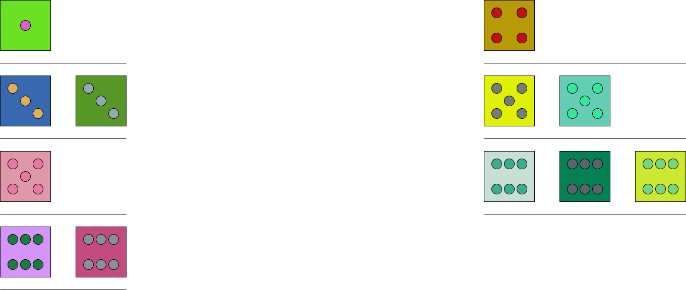

# SP1

Et program som slår terninger og tegner dem i et vindue.
Terningerne har to farve parametre man kan ændre på. Terningens farve og øjnenes farve.
Normalt så har terningerne kun 6 sider, men man kan ændre det til et højere tal med terningernes variabel "maxNumber", hvis man vil ændre på flere terninger og de er i et DiceCup objekt, så kan man bruge funktionen setMaxNumber(int num).
Der er kun 9 sider af en terning som kan vises med øjne, så hvis terningens tal er højere vil tallet være skrevet på terningen i stedet for øjne.
Terningerne er altid firkanten, ligemeget hvor mange sider du angiver den skal have.
Man kan også angive terningerns størrelse.

Herunder er vist eksempler på hvad man kan gøre med de forskellige indstillinger.

## 6 terninger med 6 sider.

## 12 terninger med 6 sider, delt op i to DiceCup objekter.

## 6 terninger med 100 sider

## 4 terninger med 9 sider

## 1000 terninger med 9 sider der har en mindre størrelse, ikke alle terninger er vist.
